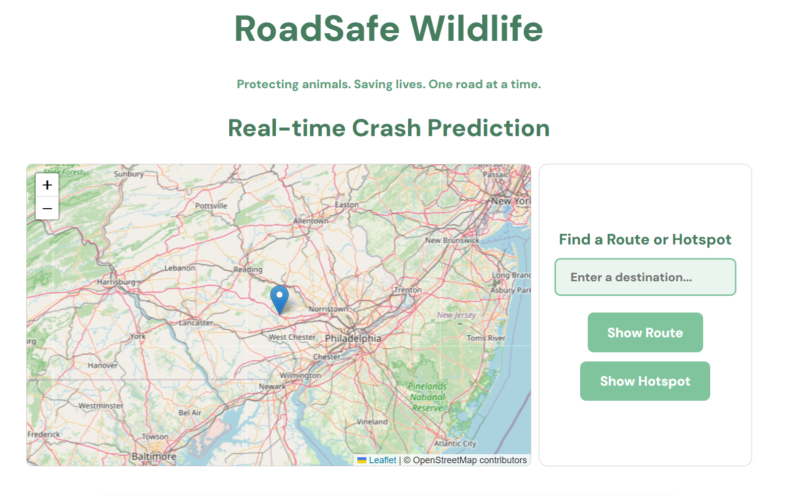
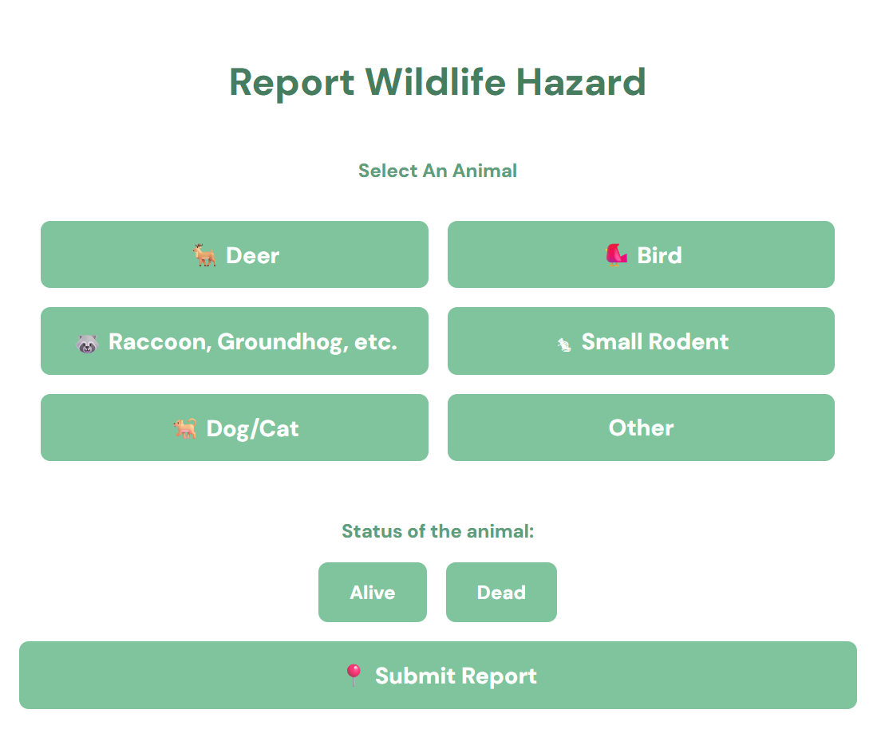
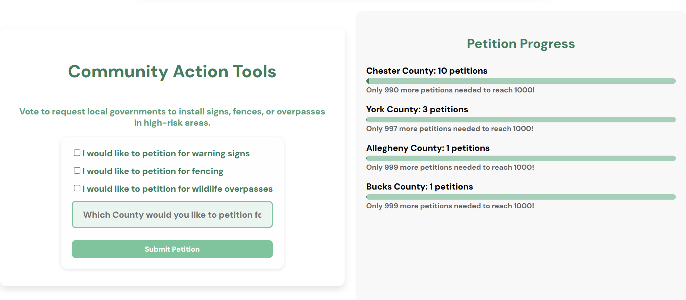

# RoadSafe

RoadSafe Wildlife is a Progressive Web App (PWA) designed to reduce wildlife-vehicle collisions by enabling users to report wildlife sightings, hazards, and roadkill using real-time GPS tagging. The app uses machine learning to predict high-risk crossing areas and alerts drivers, communities, and local agencies. 

[Check it out here!](https://road-safe-app.netlify.app/).

## Tech Used

### Third-Party Sources
* Firebase 
* PennDOT 
* Render 
* OpenRouteService 
* Netlify 
* Leaflet
* GitHub
* Cursor IDE

### Libraries
* scikit-learn
* joblib
* numpy
* pandas
* matplotlib

## Lessons Learned
* Handling geolocation permissions and accuracy on mobile devices

* Integrating ML predictions into a live React map UI

* Managing real‑time listeners and Firestore document structure

* Designing consistent UI/UX for safety‑focused apps

* Building installable PWAs with offline caching

* Connecting Python‑trained ML models to a JavaScript frontend
 
## Features

### Reporting
* Create wildlife hazard reports with automatic geolocation

* Log sightings, near‑misses, or roadkill

* Upload optional images

* View timestamp, species type, and user notes

### Interactive Map
* Real‑time community reports

* Hotspot overlays based on ML predictions

* Clickable markers to view report details

### AI Hotspot Prediction
* Random Forest classifier trained on crash datasets

* Uses environmental, spatial, and proximity‑based features

* Output displayed visually on the map

### Infrastructure
* Firebase for real‑time database

* Firebase Hosting + Storage

* Python ML pipeline with joblib‑serialized models

* Dataset used: features_for_training.csv

* Model files: hotspot_model.joblib, imputer.joblib

### UI
* Sage green and white color scheme
* Consistent layout with panels, buttons, and sectioned design

## Using RoadSafe

### 1. Access the App
* Open [RoadSafe](https://road-safe-app.netlify.app/) on your phone or computer

* Allow location permissions so the app can tag your current GPS location

### 2. View the Interactive Map
* Tap any place on the map to report the risk level of wildlife collision in that area

* Enter a destination in the textbox to either:
    * See a risk-colored route to that destination

    * See a hotspot risk marker for that specific area

* Tap on a marker to open the risk details

### 3. Create a Wilflide Report
* Select the animal type

* Select the animal status (dead or alive)

* Submit the report, it will instantly be saved in the database

### 4. Create a Petition Report
* Select one or more specific things you would liek to petition for

* Enter the name of the county being petitioned for

* Submit the petition, it will instantly be saved in the database

## Screenshots

### Interactive Map

### Wildlife Reporting

### Area Petitions

